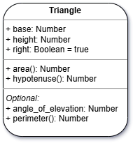
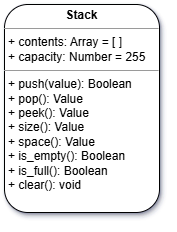

# Class Features (Practice)

###### ICS4U - Mr. Brash 🐿️

🔙 [Go back to the lesson](./README.md)

**Note:** There is example code in your [`script.js`](script.js) file.
  
1. Create a class that defines a `Triangle` with `base`, `height`, and a boolean for `right` that _defaults_ to `true`.



  - Add a **constructor** so that `base` and `height` can be set, along with `right` (which is an _optional_ third argument defaulting to `true`).  
    ```JS
    constructor(base = 1, height = 1, right = true) {
      ...
    }
    ```
  - Create a Class method `area()` which calculates and returns the area of the triangle.
  - Create the Class method `hypotenuse()` which calculates and returns the hypotenuse _only_ if it is a right-triangle. Return -1 otherwise.
  - 💪🏻 Want an _optional_ challenge?
    - Add to the `Triangle` class a variable called `angle_of_elevation`. This will be the _angle of elevation_ at the `base` of the triangle, **_in degrees_** (left or right doesn't matter).
    - Add the function `perimeter()` which calculates and returns the perimeter of the triangle. Note that the `height` of the triangle is considered an _altitude_ if the triangle is not a right-triangle. That is to say the `height` is _not_ a side-length in that instance. That's why you need the `angle_of_elevation`.

  Test your `Triangle` object thoroughly.<br>
  **Here's some test code:**<br>
  ```JS
  let tri1 = new Triangle(8, 6);          // Right triangle
  let tri2 = new Triangle(20, 14, false); // Oblique triangle

  console.log(tri1.hypotenuse(), tri2.hypotenuse());  // Should be "10 -1"
  console.log(tri1.area(), tri2.area());              // Should be "24 140"

  // If you implement the challenge `perimeter()` function:
  console.log(tri1.perimeter());  // Should be 24
  tri2.angle_of_elevation = 40;   // degrees
  console.log(tri2.perimeter());  // Should be about 56.167
  ```

  <br>

2. Recreate your `Stack` ADT as a _Class_. Some of the methods are optional, read further.



  At the very least, include a `constructor`, `contents`, `capacity`, `push()`, `pop()`, `peek()`, `is_empty()`, and `is_full()`:  

  - The `constructor` takes an optional array which represents the contents at the time of creation and an optional number representing the capacity of the stack. _Ensure that the capacity value is a positive number > 0 and round it to a whole number_.
  - The `push()` function adds to the stack and returns whether or not it was successful (`true` or `false`).
  - The `pop()` function removes _and_ returns the top item on the stack or `undefined` if the stack is empty.
  - The `peek()` function returns a copy of the top-most item on the stack or `undefined` if the stack is empty.
  - `is_empty()` returns `true` if the stack is empty and `false` otherwise.
  - `is_full()` returns `true` if the stack has reached its limit and `false` otherwise.
      
Once you have a defined `Stack` object, make sure to _test it thoroughly_. Try generating multiple stacks and maybe even place one stack into another like this:
```JS
let stack1 = new Stack([6, 5, 4, 3, 4, 5, 6], 10);
let stack2 = new Stack(["hello", "goodbye", "up", "down"]);
let stack3 = new Stack([], 2);

stack3.push(stack1);
stack3.push(stack2);
console.log(stack3.is_full());
console.log(stack3.is_empty());
console.log(stack3.peek());
```

<br>

🔙 [Go back to the lesson](./README.md)

<br>

🐿️
