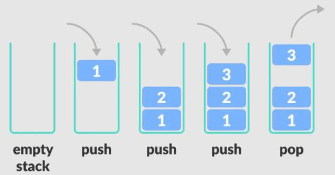

# Abstract Data Types (Practice)

###### ICS4U - Mr. Brash 🐿️

🔙 [Go back to the lesson](./README.md)

In [the script file](script.js) you will find a simple example ADT that represents a person. It is just for example sake. Take a look at the syntax and how it is structured. Feel free to test it with some quick sample code and ask your teacher if there is anything you do not understand.

## The Stack:

A [stack](https://en.wikipedia.org/wiki/Stack_(abstract_data_type)) is an [abstract data type](https://en.wikipedia.org/wiki/Abstract_data_type) that we call **L**ast **I**n **F**irst **O**ut (LIFO). It is a well-known ADT in computer science.

<br>
[Here is another visual representation of pushing and popping](https://en.wikipedia.org/wiki/Stack_(abstract_data_type)#/media/File:Lifo_stack.svg).

### A [Stack](https://en.wikipedia.org/wiki/Stack_(abstract_data_type)) employs the following properties and functions:

- `contents[]`: the contents of the stack, typically hidden - more on that in a future lesson,
- `capacity`: a number representing the maximum allowed number of elements on the stack (default it to 20),
- `push()`: if possible, add an element to the top of the stack,
- `pop()`: remove (and return) the element on the _top_ of the stack or `null` otherwise,
- `peek()`: return the element on the top of the stack _without removing it from the stack_ or `null` otherwise,
- `size()`: return the number of elements on the stack,
- `space()`: return the remaining space in the stack (if any),
- `is_empty()`: check if the stack is empty (return true/false),
- `is_full()`: check if the stack is full (return true/false),
- `clear()`: empties the stack

**Note:** in JavaScript we are sort of forced to use an *array* for the `contents`. Typically you would use [a linked list](https://simple.wikipedia.org/wiki/Linked_list) and only be able to see the "head" node.

---

#### 🤔 When might this data structure be useful?

[There are _many_ uses](https://en.wikipedia.org/wiki/Stack_(abstract_data_type)#Applications_of_stacks):

**Reversing a string or chain** - Put all the letters in a stack and pop them out. Because of the LIFO order of stack, you will get the letters in reverse order.

**Web browsers** - The back button in a browser saves all the URLs you have visited previously in a stack. Each time you visit a new page, it is added on top of the stack. When you press the back button, the current URL is removed from the stack, and the previous URL is accessed.

**Code compilers** - Compilers use the stack to calculate the value of expressions like 2 + 4 / 5 * (7 - 9) by converting the expression to prefix or postfix form.


# Your Task:
Implement a `Stack` ADT in JavaScript, as described above.<br>**Note:** in a perfect world, the `contents` would be hidden and not directly accessible. We will talk about this more in a future lesson.

Once your `Stack` is complete:
- Create a function (outside the Stack ADT code) called `reverse_string(str)`. This function will **use** the Stack to *return* the given string `str` in reverse.  
  **For Example:**
  ```JS
  reverse_string("Hello World!");
  > '!dlroW olleH'
  ```

- create a function (outside the Stack ADT code) called `reverse_number(n)`. This function will **use** the Stack to *return* a *number* in reverse order. All data should *remain* a *number*. Do **not** convert to a string.  
  **For Example:**
  ```JS
  reverse_number(87631);
  > 13678
  ```  
  **Hint:** [the remainder operator](https://developer.mozilla.org/en-US/docs/Web/JavaScript/Reference/Operators/Remainder) can help with this task.

  Again - the return value of `reverse_number()` must be *a number* (type: `number`), not a string and you should never convert to anything other than a number in that function.

  ‼️ **It goes without saying that you are _not_ permitted to use any built-in sorting, slicing, splicing, reversing, or mapping functions for this task.**

<br>

#### If you finish early, see Mr. Brash about another use for the Stack ADT.

<div style="text-align:center"><h3>Happy Coding! 🐿️</h3></div>

🔙 [Go back to the lesson](./README.md)

---

<br><br>
